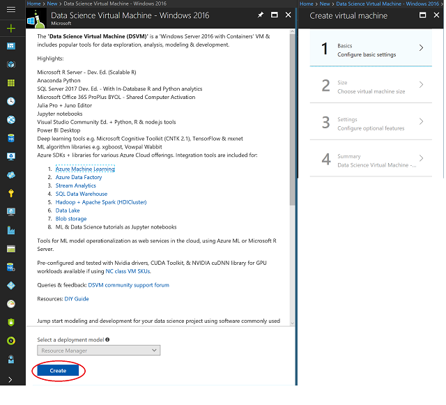

# Provision the Windows Data Science Virtual Machine

## Create your Microsoft Data Science Virtual Machine
To create an instance of the Microsoft Data Science Virtual Machine, follow these steps:

1. Cick <a href="https://portal.azure.com/#create/microsoft-ads.windows-data-science-vmwindows2016" about="_blank">Create DS VM</a>
2. Select the **Create** button at the bottom to be taken into a wizard.
3. The wizard used to create the Microsoft Data Science Virtual Machine requires **inputs** for each of the **four steps** enumerated on the right of this figure. Here are the inputs needed to configure each of these steps:
   
   1. **Basics**
      
      1. **Name**: Name of your data science server you are creating.
      2. **VM Disk Type**: Choose SSD
      3. **User Name**: Admin account login id. e.g.) **datascience**
      4. **Password**: Admin account password. e.g.) **DataScience1!**
      5. **Subscription**: If you have more than one subscription, select the one on which the machine is to be created and billed.
      6. **Resource Group**: You can create a new one e.g.) **datascience-hol-rg**, or use an existing group.
      7. **Location**: Select the data center that is most appropriate. e.g.) **west us 2**
   2. **Size**: Use **D4s_v3**
   3. **Settings**:
      
      1. **Use Managed Disks**: Choose Managed
      2. **Other parameters**: Usually you just use the default values. If you want to consider using non-default values, hover over the informational link for help on the specific fields.
    a. **Summary**: Verify that all information you entered is correct and click **Create**. **NOTE**: The VM does not have any additional charges beyond the compute for the server size you chose in the **Size** step. 

> [!NOTE]
> The provisioning should take about **10-15** minutes. The status of the provisioning is displayed on the Azure portal.
> 

## How to access the Microsoft Data Science Virtual Machine
Once the VM is created, you can remote desktop into it using the Admin account credentials that you configured in the preceding **Basics** section. 

Once your VM is created and provisioned, you are ready to start using the tools that are installed and configured on it. There are start menu tiles and desktop icons for many of the tools. 

## Next Steps

1. [Install Docker for Windows](./02.InstallDocker.md)