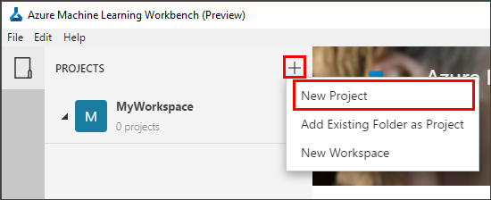

# Tutorial 1: Classify Iris - Preparing the data

Azure Machine Learning service (preview) is an integrated, end-to-end data science and advanced analytics solution for professional data scientists to prepare data, develop experiments, and deploy models at cloud scale.

This tutorial is **part one of a three-part series**. In this part of the tutorial, you use Azure Machine Learning services to:

* Create a project in Azure Machine Learning Workbench

## Create a new project in Workbench

1. Open the Azure Machine Learning Workbench app, and log in if needed. 
   
   + On Windows, launch it using the **Machine Learning Workbench** desktop shortcut. 
   + On macOS, select **Azure ML Workbench** in Launchpad.

1. Select the plus sign (+) in the **PROJECTS** pane and choose **New Project**.  

   

1. Fill out of the form fields and select the **Create** button to create a new project in the Workbench.

   Field|Suggested value for tutorial|Description
   ---|---|---
   Project name | myIris |Enter a unique name that identifies your account. You can use your own name, or a departmental or project name that best identifies the experiment. The name should be 2 to 32 characters. It should include only alphanumeric characters and the dash (-) character. 
   Project directory | c:\Temp\ | Specify the directory in which the project is created.
   Project description | _leave blank_ | Optional field useful for describing the projects.
   Visualstudio.com GIT Repository URL |_leave blank_ | Optional field. You can associate a project with a Git repository on Visual Studio Team Services for source control and collaboration. [Learn how to set that up](https://docs.microsoft.com/azure/machine-learning/desktop-workbench/using-git-ml-project#step-3-set-up-a-machine-learning-project-and-git-repo). 
   Selected workspace | IrisGarden (if it exists) | Choose a workspace that you have created for your Experimentation account in the Azure portal.  If you followed the Quickstart, you should have a workspace by the name IrisGarden. If not, select the one you created when you created your Experimentation account or any other you want to use.
   Project template | Classifying Iris | Templates contain scripts and data you can use to explore the product. This template contains the scripts and data you need for this quickstart and other tutorials in this documentation site. 

   
 
 A new project is created and the project dashboard opens with that project. At this point, you can explore the project home page, data sources, notebooks, and source code files. 

   
 
## Next steps

In this tutorial, you used Azure Machine Learning Workbench to:
* Create a new project

You are ready to move on to the next part in the tutorial series, where you learn how to build an Azure Machine Learning model:

> [Tutorial 2 - Build models](02.ModelSelection.md)
