# Install Docker for Windows on DSVM

Duration: 20 mins

## Login to DSVM

1. Make sure you are logged on a Azure Data Science Virtual Machine. 

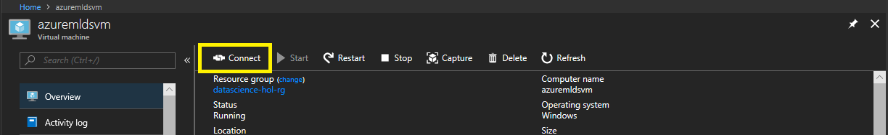

2. Click and download RDP file and run the profile to access.

> To login DSVM, use ID and password you set in previous step. 
> For example, **datascience** for ID and **DataScience1!** for password.

3. Once you're logged in DSVM, open **Firefox** browser and go to this online guide **https://aka.ms/mtcs-azureml/**.

4. And go to step "02.InstallDocker"

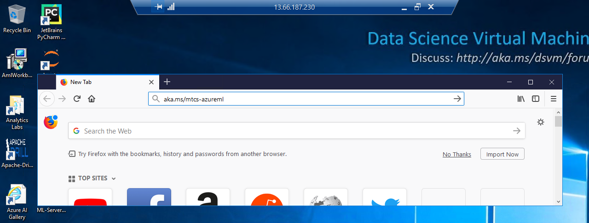

## Download Docker for Windows and Inststall Docker

1. Click <a href="https://docs.docker.com/docker-for-windows/install/" target="_blank">Docker for Windows</a> and download the installer.

> Note that, docker store may ask you to login their site. In case you don't have accout, you need to create an account which will take couple of minutes.
>> 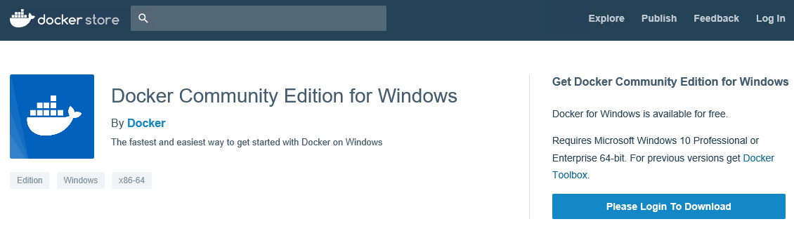

2. While you install Docker, **DO NOT** check windows container option.

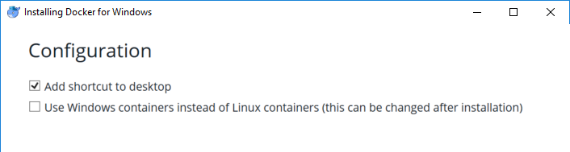

3. When install is done, you'll be asked logout for the VM. Note that if you are install or running any other application please be careful. 

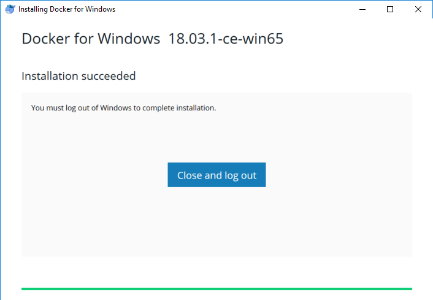

4. A mintue later you can login to DSVM again. When you login, please wait a second, soon you will see a warning 'Hyper-V feature is not enabled'. Click on Ok and restart the machine. It way take 2 minutes. 

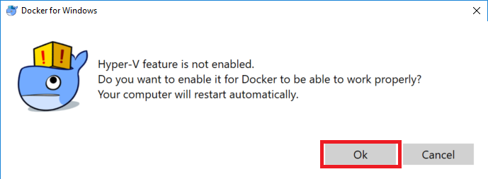

5. Please login to DSVM again. And you'll see docker popup soon.

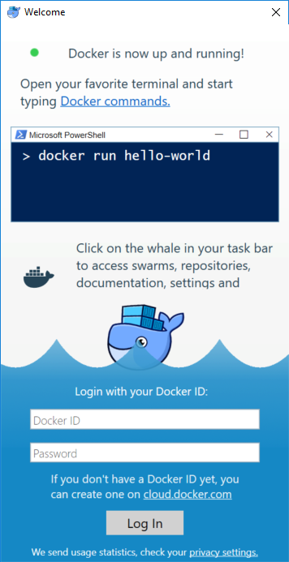

## Config Docker environment 

Since you have docker that is running as Windows OSType on your DSVM, you need to change docker as linux ostype.

By following next steps you'll reset Docker as factory setting.

### Change os type of Docker

Before actually apply changes, let's make sure that Docker is running windows ostype. 

1. Open windows command console. 

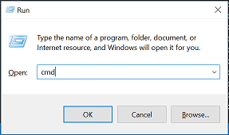

2. Run following command at the console and confirm OS Type of Docker. If it is set as linux then to go next step, [Install Azure Machine Learning Workbench](./03.InstallAzureMLWorkbench.md).

```
docker info
```

If OS type is shown as __Windows__ then, follow next steps. 

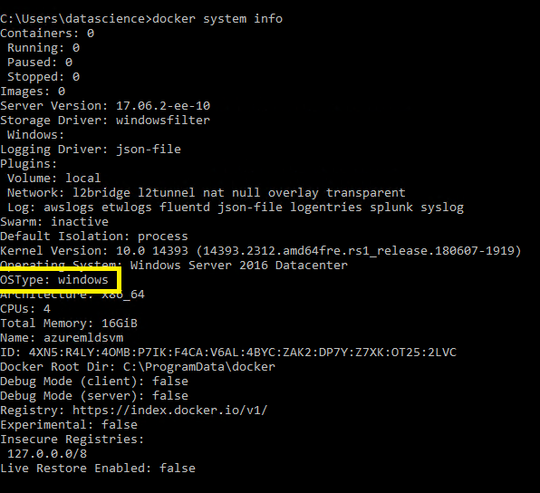

3. Find docker icon right bottom tray icon.


4. Right click on it and then click __Switch to Windows Container__.

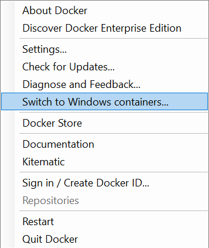

> If you see an error that Hyper-V is not enabled, please click on __enable Hyper-V__. It will be rebooted. Please refer [previous step](./02.InstallDocker.md#download-docker-for-windows-and-inststall-docker) for detail. 

5. You'll see an error, please click on __Reset__ button. It may take 5 minnutes to restart docker service.

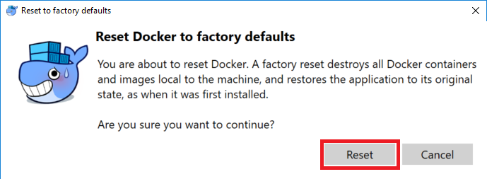

### Confirm Docker status 

1. Once you see pop of docker, open windows command console.

2. Run following command at the console.

```
docker info
```

3. Make sure that Docker is running linux os type on your machine.

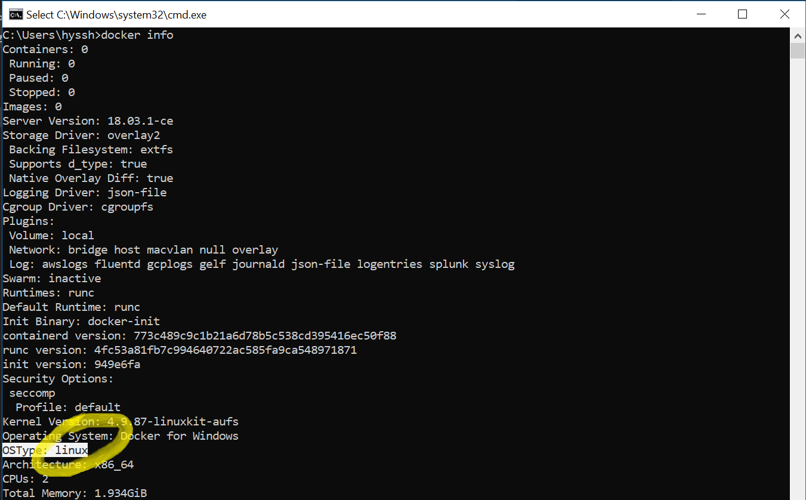

## Next Step

[Install Azure Machine Learning Workbench](./03.InstallAzureMLWorkbench.md)