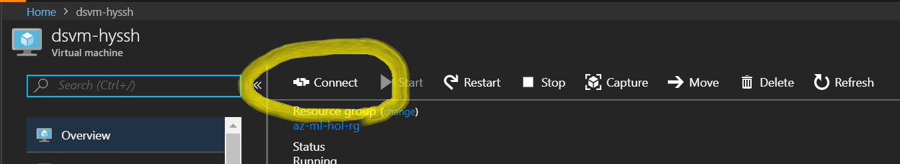

# Install Docker for Windows on DSVM

Duration: 10 mins

## Login to DSVM on Azure

Make sure you are logged on a Azure Data Science Virtual Machine. 



## Download Docker for Windows 

1. Click <a href="https://docs.docker.com/docker-for-windows/install/"  about="_blank">Download Docker for Windows</a> to download install file.

## Install 


## Confirm Docker installation 

1. Open windows command console.


2. Run following command at the console.

```
docker info
```

3. Make sure that Docker is running linux os type on your machine.


## Next Step

[Install Azure Machine Learning Workbench](./03.InstallAzureMLWorkbench.md)