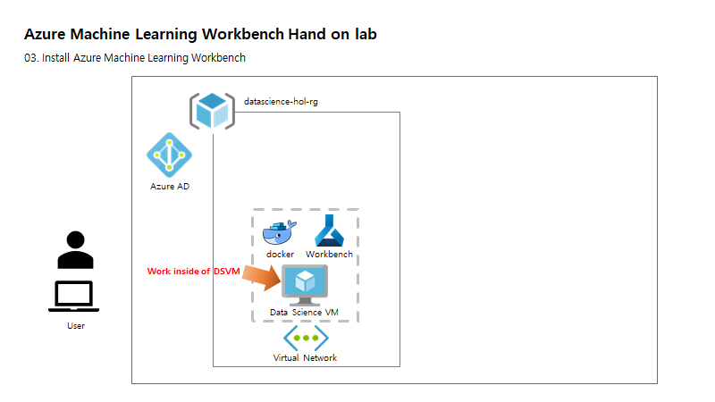

# Install and log in to Workbench

Duration: 30 mins



## Download and install

1. Download and launch the latest Workbench installer. 

> Download the installer fully on disk, and then run it from there. Do not run it directly from your browser's download widget.

**On Windows:** 

A. Download <a href="https://aka.ms/azureml-wb-msi" target="_blank">AmlWorkbenchSetup.msi</a><br/>
B. Double-click on the downloaded installer in File Explorer.

1. Follow the on-screen instructions in your installer to completion. 

**The installation might take around 30 minutes to complete.**  

| |Installation path to Azure Machine Learning Workbench|
|--------|------------------------------------------------|
|Windows|C:\Users\\<user\>\AppData\Local\AmlWorkbench|

> The installer will download and set up all the necessary dependencies, such as Python, Miniconda, and other related libraries. This installation also includes the Azure cross-platform command-line tool, or Azure CLI.


## Configure IDE

In order to work or edit python script, you need an IDE tool. A project on Azure Machine Learning Workbench can be linked to Visual Studio Code easily so you can continue to work on the project.

1. From the Workbench menu, select **File** > **Confugure Project IDE**. 

1. Type **name** as **VS_Code**.

1. Click **Browser** and find Visual Studio Code path.

  - Windows 64-bit - **C:\Program Files\Microsoft VS Code\Code.exe**

## Enable Azure Cli for ML project

In order to run cli for the lab, you need to log in from commnad prompt by following next steps.

1. From the Workbench menu, select **File** > **Open Command Prompt**. 

2. Type **az login**, copy __CODE__ from the console windows

3. Open a browser, go to <a href="https://aka.ms/devicelogin" about="_blank">device login portal(https://aka.ms/devicelogin)</a> and pate code to textbox.

```
az login
```


> If you are not loged in Azure yet, it may ask you to login azure.

3. Once authenciateion is done, run following command.

```azcli
az account list --output table
```

4. Select your subscription for this lab.


```azcli
az account set -s "yoursubscription ID or NANE"
```

5. Confirm your subscriion with following command.

```azcli
az account show
```


## Check hands on lab environment 

To complete this hands on lab, Container Service must be registered. To confirm the Azure resource provider **Microsoft.ContainerRegistry** is registered in your subscription. You must register this resource provider before you can create an environment in step 

1. Open the command-line interface (CLI). (Or continue to work on the commnad prompt from previous setp.) In the Machine Learning Workbench application, on the **File** menu, select **Open Command Prompt**.

2. You can check to see if it's already registered by using the following command:
``` 
az provider list --query "[].{Provider:namespace, Status:registrationState}" --out table 
``` 

You should see output like this:


3. If **Microsoft.ContainerRegistry** or **Microsoft.ContainerService** is NOT registered, you can register it by using the following command:
``` 
az provider register --namespace Microsoft.ContainerRegistry 
az provider register --namespace Microsoft.ContainerService 
```

Registration can take a few minutes. You can check on its status by using the previous **az provider list** command or the following command:
``` 
az provider show -n Microsoft.ContainerRegistry 
az provider show -n Microsoft.ContainerService
``` 

The third line of the output displays **"registrationState": "Registering"**. Wait a few moments and repeat the **show** command until the output displays **"registrationState": "Registered"**.

## Next Step

[Create Azure Machine Learning services accounts](./04.CreateAZMLServices.md)
