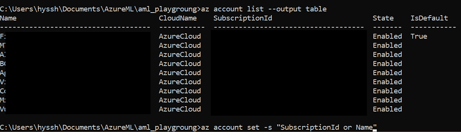

# Tutorial 1: Classify Iris - Preparing the data

Azure Machine Learning service (preview) is an integrated, end-to-end data science and advanced analytics solution for professional data scientists to prepare data, develop experiments, and deploy models at cloud scale.

This tutorial is **part one of a three-part series**. In this part of the tutorial, you use Azure Machine Learning services to:

* Create a project in Azure Machine Learning Workbench

## Create a new project in Workbench

1. Open the Azure Machine Learning Workbench app, and log in if needed. 
   
   + On Windows, launch it using the **Machine Learning Workbench** desktop shortcut. 
   + On macOS, select **Azure ML Workbench** in Launchpad.

1. Select the plus sign (+) in the **PROJECTS** pane and choose **New Project**.  

   

1. Fill out of the form fields and select the **Create** button to create a new project in the Workbench.

   Field|Suggested value for tutorial|Description
   ---|---|---
   Project name | myIris |Enter a unique name that identifies your account. You can use your own name, or a departmental or project name that best identifies the experiment. The name should be 2 to 32 characters. It should include only alphanumeric characters and the dash (-) character. 
   Project directory | c:\Temp\ | Specify the directory in which the project is created.
   Project description | _leave blank_ | Optional field useful for describing the projects.
   Visualstudio.com GIT Repository URL |_leave blank_ | Optional field. You can associate a project with a Git repository on Visual Studio Team Services for source control and collaboration. [Learn how to set that up](https://docs.microsoft.com/azure/machine-learning/desktop-workbench/using-git-ml-project#step-3-set-up-a-machine-learning-project-and-git-repo). 
   Selected workspace | IrisGarden (if it exists) | Choose a workspace that you have created for your Experimentation account in the Azure portal. <br/>If you followed the Quickstart, you should have a workspace by the name IrisGarden. If not, select the one you created when you created your Experimentation account or any other you want to use.
   Project template | Classifying Iris | Templates contain scripts and data you can use to explore the product. This template contains the scripts and data you need for this quickstart and other tutorials in this documentation site. 

   
 
 A new project is created and the project dashboard opens with that project. At this point, you can explore the project home page, data sources, notebooks, and source code files. 

   

## Configure IDE

In order to work or edit python script, you need an IDE tool. A project on Azure Machine Learning Workbench can be linked to Visual Studio Code easily so you can continue to work on the project.

1. From the Workbench menu, select **File** > **Confugure Project IDE**. 

1. Type **name** as **VS_Code**.

1. Click **Browser** and find Visual Studio Code path.

  - Windows 32-bit - **C:\Program Files (x86)\Microsoft VS Code\Code.exe**
  - Windows 64-bit - **C:\Program Files\Microsoft VS Code\Code.exe**
  - macOS - select the .app path, for example **/Applications/Visual Studio Code.app**, and the app appends the rest of the path for you. The full path to the executable by default is **/Applications/Visual Studio Code.app/Contents/Resources/app/bin/code**. If you have executed the Shell Command: Install 'code' command in PATH command in VS Code, then you can also reference the VS Code script at **/usr/local/bin/code**.

## az Login

In order to run cli for the lab, you need to log in from commnad prompt by following next steps.

1. From the Workbench menu, select **File** > **Open Command Prompt**. 

2. Type **az login**, copy __CODE__ and open a browser, go to <a href="https://aka.ms/devicelogin" about="_blank">device login portal</a> and pate code to textbox.

  > [NOTE] If you are not loged in Azure yet, it may ask you to login azure.

```
az login
```


3. Once authenciateion is done, run following command.

```azcli
az account list --output table
```

And select your subscription for this lab.



```azcli
az account set -s "yoursubscription ID or NANE"
```

4. Confirm your subscriion with following command.

```azcli
az account show
```


## Next steps

[Model Selection](./06.ModelSelection.md)