# Tutorial 2 (Continue): Classify Iris - Build a model (2/3)

## 4. Logging new metrics 

We will add two new metrics to the logger in the `iris_sklearn.py` script, then rerun the experiments to see the additional output that is created as a result.

### 4.1. Archive old jobs

go the the **Runs** tab and click on **All Runs**. Scroll down to the table listing all the runs, click on the checkbox next to `RUN NUMBER` to select them all and click on **Archive**. Repeat this until all the runs have been archived.

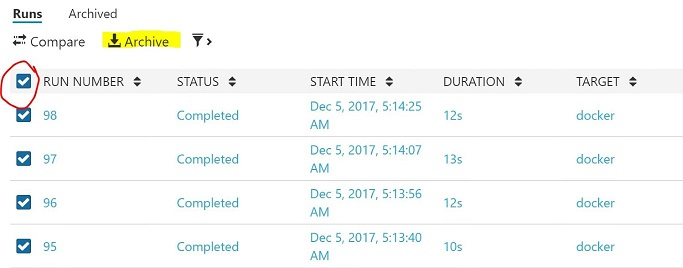

### 4.2. Add new logs for FScore

Since the training experiment `iris_sklearn.py` keeps track on precision and recall, we can use those to find the **F-score** which is a sort of average of precision and recall. In our script, the variables `precision` and `recall` are not single numbers but arrays. This is because obtain a different precision and recall by changing our probability threshold for being classified as positive. Similarly, we obtain an array of F-scores by using different threshold values, so we will also log the maximum F-score value (a single number). In **VS Code** paste in the below code snippet after line 71 in `iris_sklearn.py`, then save the script.

```
f_score = 2*(precision*recall)/(precision + recall)
run_logger.log("Fscore", f_score)
run_logger.log("MaxFscore", max(f_score))
print ("Max F_1 is {}".format(max(f_score)))
```

It'll looks like following.

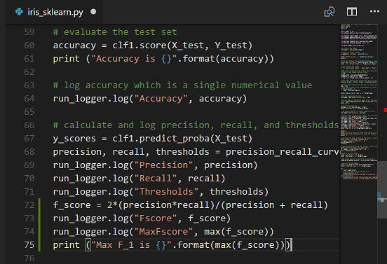

### 4.3. Run multiple experiments and review results

From the **Command Prompt** run `python run.py` again. And go to the **Jobs** pannel to monitor jobs as they are running. Once all the jobs are finish running, click on the green **Completed** button to view their output. Find the job with regularization rate 0.009765625 and report its maximum F-score (under `Max F_1 is ...`). The output on this page is produced as a result of `print` statements in the script (or functions that return output). 

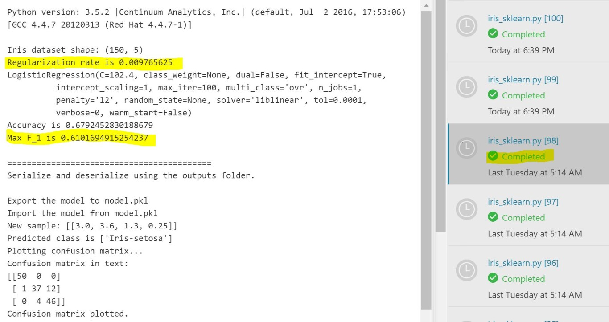

For the same run, now click on the blue link just above the green **Completed** button to see the **Run Properties** pane. Find the regularization rate and the F-score in this tab. The output in this pane is created partly as a result of meta-data collected for each job (such as **Start Time** and **Duration**) and partly as a result of metrics that we logged using the `run_logger.log` function. 

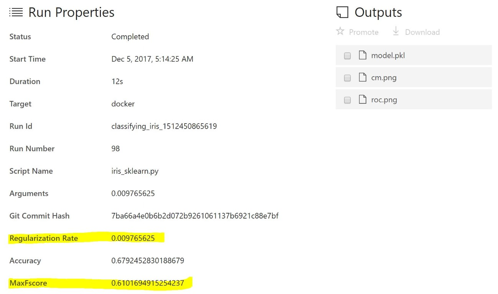

Scroll down to see the visuals created by array we logged, including the `Fscore` visual that should now also appear.

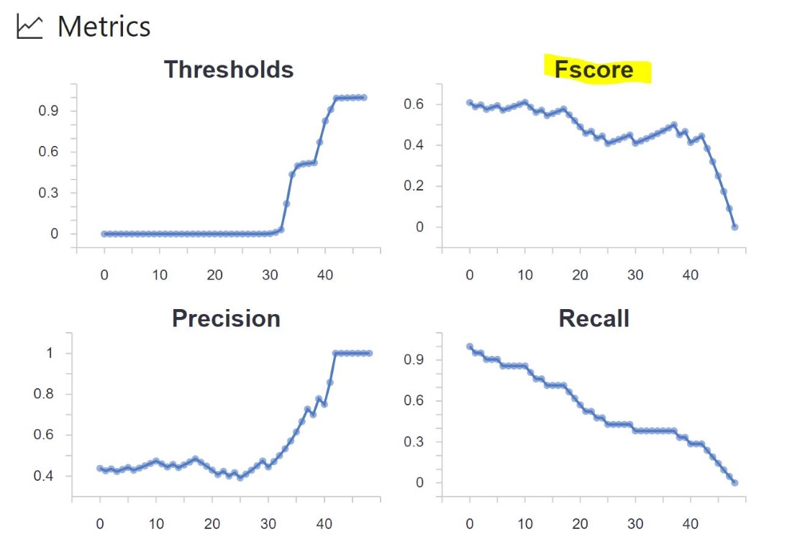

Scroll further down to look at visualizations created by the Python script itself. These visualizations were not explicitly logged, but they are also tracked and presented here.

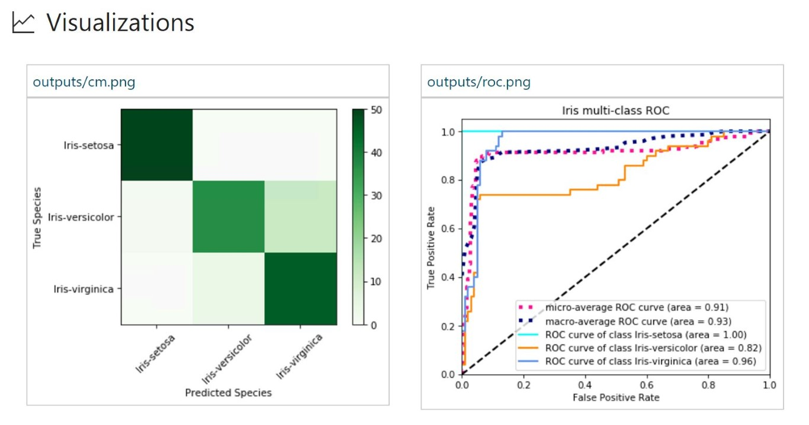

### 4.4. Customize List View 

Click on **All Runs** from the **Runs** tab and click on the little settings icon on the right.

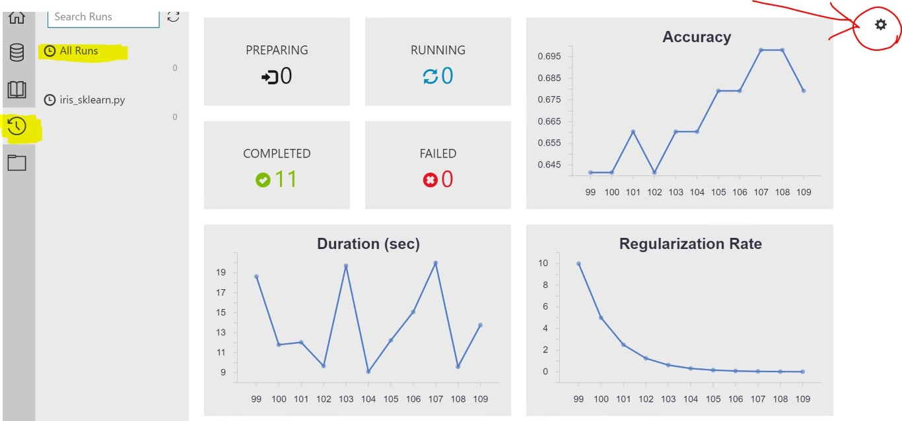
   
In the window that opens, put a check mark in the box next to `MaxFscore` then click on **Apply**.

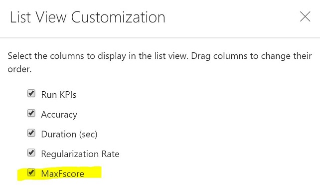

We should now see an additional plot showing the value for `MaxFscore` accross the different runs.

Choose the two models with the highest `MaxFscore` (simply click on the two highest point on the chart). Notice how doing so automatically selects them in the table with all the runs just below the chart. Now click on the **Compare** button to compare the two models.

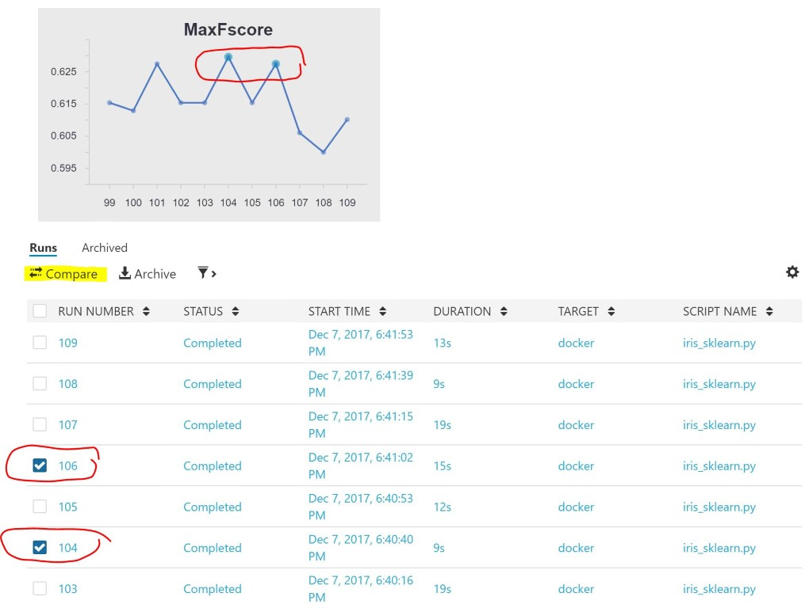
   
Of the two models, find the one with the highest accuracy (we will find accuracy under **Logged Metrics**) and note its `runNumber` (at the very top). Then click on **Run List** to return to the table of all the runs and this time click on the `RUN NUMBER` for that model.

## 5. Compare Results

In Azure Machine Learning Workbench, every script execution is captured as a run history record. If you open the **Runs** view, you can view the run history of a particular script.

1. To open the list of **Runs**, select the **Runs** button (clock icon) on the left toolbar. Then select **iris_sklearn.py** to show the **Run Dashboard** of `iris_sklearn.py`.

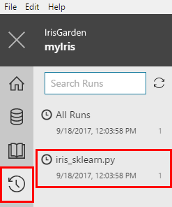

2. The **Run Dashboard** tab opens. 

Review the statistics captured across the multiple runs. Graphs render in the top of the tab. Each run has a consecutive number, and the run details are listed in the table at the bottom of the screen.

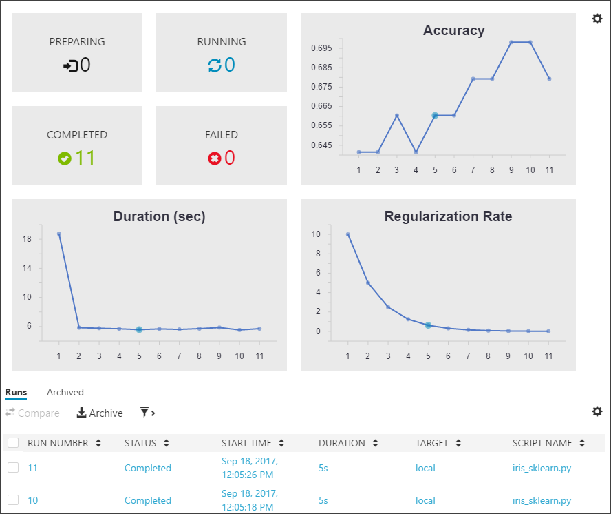

3. Filter the table, and then select any of the graphs to view the status, duration, accuracy, and regularization rate of each run. 

4. Select the checkboxes next to two or three runs in the **Runs** table. Select the **Compare** button to open a detailed comparison pane. Review the side-by-side comparison. 

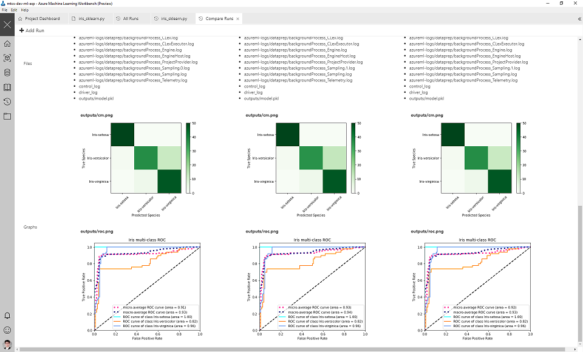

5. To return to the **Run Dashboard**, select the **Run List** back button on the upper left of the **Comparison** pane.

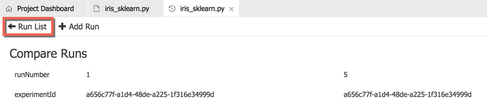

In this second part of the three-part tutorial series, you learned how to:
* Open scripts and review the code in Workbench
* Execute scripts in a local environment
* Review the run history
* Execute scripts in a local Docker environment

## Next steps

[Deploy Model](./07.DeployModel.md)
