# Tutorial 2: Classify Iris - Build a model

Azure Machine Learning services (preview) are an integrated, data science and advanced analytics solution for professional data scientists to prepare data, develop experiments, and deploy models at cloud scale.

This tutorial is **part two of a three-part series**. In this part of the tutorial, you use Azure Machine Learning services to:

* Open scripts and review code
* Execute scripts in a local environment
* Review run histories
* Execute scripts in a local Docker environment

## Review iris_sklearn.py and the configuration files

1. Launch the Azure Machine Learning Workbench application.

1. Open the **myIris** project you created in [Part 1 of the tutorial series](tutorial-classifying-iris-part-1.md).

2. In the open project, select the **Files** button (the folder icon) on the far-left pane to open the file list in your project folder.

   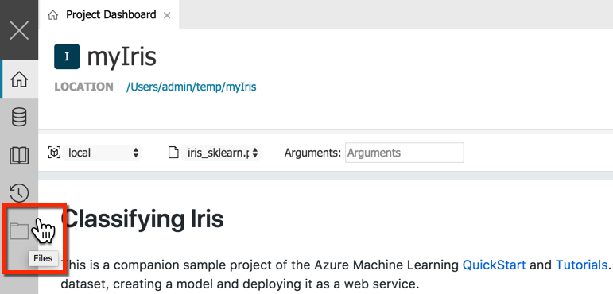

3. Select the **iris_sklearn.py** Python script file. 

   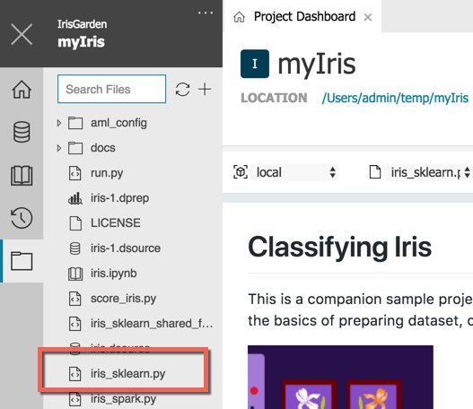

   The code opens in a new text editor tab inside the Workbench. This is the script you use throughout this part of the tutorial. 

   >[NOTE]
   >The code you see might not be exactly the same as the preceding code, because this sample project is updated frequently.
   
   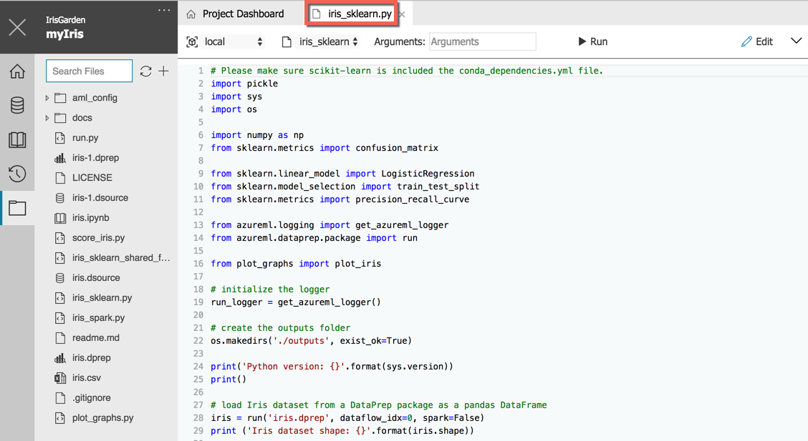

4. Inspect the Python script code to become familiar with the coding style. 

   The script **iris_sklearn.py** performs the following tasks:

   * Loads the default data preparation package called **iris.dprep** to create a [pandas DataFrame](https://pandas.pydata.org/pandas-docs/stable/generated/pandas.DataFrame.html). 

   * Adds random features to make the problem more difficult to solve. Randomness is necessary because Iris is a small data set that is easily classified with nearly 100% accuracy.

   * Uses the [scikit-learn](http://scikit-learn.org/stable/index.html) machine learning library to build a logistic regression model.  This library comes with Azure Machine Learning Workbench by default.

   * Serializes the model using the [pickle](https://docs.python.org/3/library/pickle.html) library into a file in the `outputs` folder. 
   
   * Loads the serialized model, and then deserializes it back into memory.

   * Uses the deserialized model to make a prediction on a new record. 

   * Plots two graphs, a confusion matrix and a multi-class receiver operating characteristic (ROC) curve, using the [matplotlib](https://matplotlib.org/) library, and then saves them in the `outputs` folder. You can install this library in your environment if it isn't there already.

   * Plots the regulatization rate and model accuracy in the run history automatically. The `run_logger` object is used throughout to record the regularization rate and the model accuracy into the logs. 


## Run iris_sklearn.py in your local environment

1. Start the Azure Machine Learning command-line interface (CLI):
   1. Launch the Azure Machine Learning Workbench.

   1. From the Workbench menu, select **File** > **Open Command Prompt**. 
   
   The Azure Machine Learning command-line interface (CLI) window starts in the project folder  `C:\Temp\myIris\>` on Windows. This project is the same as the one you created in Part 1 of the tutorial.

   >[!IMPORTANT]
   >You must use this CLI window to accomplish the next steps.

1. In the CLI window, install the Python plotting library, **matplotlib**, if you do not already have the library.

   The **iris_sklearn.py** script has dependencies on two Python packages: **scikit-learn** and **matplotlib**.  The **scikit-learn** package is installed by Azure Machine Learning Workbench for your convenience. But, you need to install **matplotlib** if you don't have it installed yet.

   If you move on without installing **matplotlib**, the code in this tutorial can still run successfully. However, the code will not be able to produce the confusion matrix output and the multi-class ROC curve plots shown in the history visualizations.

   ```azurecli
   pip install matplotlib
   ```

   This install takes about a minute.

1. Return to the Workbench application. 

1. Find the tab called **iris_sklearn.py**. 

   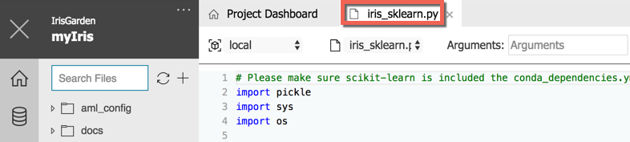

1. In the toolbar of that tab, select **local** as the execution environment, and `iris_sklearn.py` as the script to run. These may already be selected.

   

1. Move to the right side of the toolbar and enter `0.01` in the **Arguments** field. 

   This value corresponds to the regularization rate of the logistic regression model.

   

1. Select the **Run** button. A job is immediately scheduled. The job is listed in the **Jobs** pane on the right side of the workbench window. 

   

   After a few moments, the status of the job transitions from **Submitting**, to **Running**, and finally to **Completed**.

1. Select **Completed** in the job status text in the **Jobs** pane. 

   

   A pop-up window opens and displays the standard output (stdout) text for the run. To close the stdout text, select the **Close** (**x**) button on the upper right of the pop-up window.

   

9. In the same job status in the **Jobs** pane, select the blue text **iris_sklearn.py [n]** (_n_ is the run number) just above the **Completed** status and the start time. The **Run Properties** window opens and shows the following information for that particular run:
   - **Run Properties** information
   - **Outputs**
   - **Metrics**
   - **Visualizations**, if any
   - **Logs** 

   When the run is finished, the pop-up window shows the following results:

   >[NOTE]
   >Because the tutorial introduced some randomization into the training set earlier, your exact results might vary from the results shown here.

   ```text
   Python version: 3.5.2 |Continuum Analytics, Inc.| (default, Jul  5 2016, 11:41:13) [MSC v.1900 64 bit (AMD64)]
   
   Iris dataset shape: (150, 5)
   Regularization rate is 0.01
   LogisticRegression(C=100.0, class_weight=None, dual=False, fit_intercept=True,
          intercept_scaling=1, max_iter=100, multi_class='ovr', n_jobs=1,
          penalty='l2', random_state=None, solver='liblinear', tol=0.0001,
          verbose=0, warm_start=False)
   Accuracy is 0.6792452830188679
   
   ==========================================
   Serialize and deserialize using the outputs folder.
   
   Export the model to model.pkl
   Import the model from model.pkl
   New sample: [[3.0, 3.6, 1.3, 0.25]]
   Predicted class is ['Iris-setosa']
   Plotting confusion matrix...
   Confusion matrix in text:
   [[50  0  0]
    [ 1 37 12]
    [ 0  4 46]]
   Confusion matrix plotted.
   Plotting ROC curve....
   ROC curve plotted.
   Confusion matrix and ROC curve plotted. See them in Run History details pane.
   ```
    
10. Close the **Run Properties** tab, and then return to the **iris_sklearn.py** tab. 

11. Repeat for additional runs. 

    Enter a series of values in the **Arguments** field ranging from `0.001` to `10`. Select **Run** to execute the code a few more times. The argument value you change each time is fed to the logistic regression model in the code, resulting in different findings each time.

## Running multiple experiments

### Run experiments on Docker in a local machine

1. Go to **File > Open Project (Code)** to edit the project scripts using Code. 

2. Open the script called **iris_sklearn.py**. 

3. Go to lines __45-48__ and examine the code snippet there. 

  > [NOTE]
  > We use the sys.argv function to pass extra arguments to Python when we run it from the command line. In our script, we have an optional regularization parameter that we can declare when we before running the experiment (otherwise it defaults to the value in line 45).

We will now run multiple experiments in order to perform model selection. Each experiment will consist of a model with a different regularization parameter. To make it easier to iterate over the different vaules of the regularization parameter, we have the short script called run.py with creates a list of regularization parameters we want to iterate over and then runs the same az ml experiment submit command we ran earlier, but this time with the regularization parameter explicitly passed as well. 

4. __Open__ **run.py** in Code and __change__ **local** to **docker-python** in line 9. Save the change.

5. Return to the __command line__ and run **python run.py** to run multiple experiments. 

6. As the experiments are running, __return to the Workbench__ and open the **Jobs** pannel on the right-hand side and monitor jobs as they’re running. Click on the green Completed button for one of the jobs to examine the logs created by the script.

## Run scripts in local Docker environments

Optionally, you can experiment with running scripts against a local Docker container. You can configure additional execution environments, such as Docker, and run your script in those environments. 

>[NOTE]
>To experiment with dispatching scripts to run in a Docker container in a remote Azure VM or an Azure HDInsight Spark cluster, you can follow the [instructions to create an Ubuntu-based Azure Data Science Virtual Machine or HDInsight cluster](https://docs.microsoft.com/en-us/azure/machine-learning/data-science-virtual-machine/provision-vm#create-your-microsoft-data-science-virtual-machine).

1. If you have not yet done so, install and start Docker locally on your Windows or MacOS machine. For more information, see the Docker installation instructions at https://docs.docker.com/install/. Community edition is sufficient.

1. On the left pane, select the **Folder** icon to open the **Files** list for your project. Expand the `aml_config` folder. 

2. There are several environments that are preconfigured: **docker-python**, **docker-spark**, and **local**. 

   Each environment has two files, such as `docker.compute` (for both **docker-python** and **docker-spark**) and `docker-python.runconfig`. Open each file to see that certain options are configurable in the text editor.  

   To clean up, select **Close** (**x**) on the tabs for any open text editors.

3. Run the **iris_sklearn.py** script by using the **docker-python** environment: 

   - On the left toolbar, select the **Clock** icon to open the **Runs** pane. Select **All Runs**. 

   - On the top of the **All Runs** tab, select **docker-python** as the targeted environment instead of the default **local**. 

   - Next, move to the right side and select **iris_sklearn.py** as the script to run. 

   - Leave the **Arguments** field blank because the script specifies a default value. 

   - Select the **Run** button.

4. Observe that a new job starts. It appears in the **Jobs** pane on the right side of the workbench window.

   When you run against Docker for the first time, the job takes a few extra minutes to finish. 

   Behind the scenes, Azure Machine Learning Workbench builds a new Docker file. 
   The new file references the base Docker image specified in the `docker.compute` file and the dependency Python packages specified in the `conda_dependencies.yml` file. 
   
   The Docker engine performs the following tasks:

    - Downloads the base image from Azure.
    - Installs the Python packages specified in the `conda_dependencies.yml` file.
    - Starts a Docker container.
    - Copies or references, depending on the run configuration, the local copy of the project folder.      
    - Executes the `iris_sklearn.py` script.

   In the end, you should see the exact same results as you do when you target **local**.

5. Now, let's try Spark. The Docker base image contains a preinstalled and configured Spark instance that you can use to execute a PySpark script. Using this base image is an easy way to develop and test your Spark program, without having to spend time installing and configuring Spark yourself. 

   Open the `iris_spark.py` file. This script loads the `iris.csv` data file, and uses the logistic regression algorithm from the Spark Machine Learning library to classify the Iris data set. Now change the run environment to **docker-spark** and the script to **iris_spark.py**, and then run it again. This process takes a little longer because a Spark session has to be created and started inside the Docker container. You can also see the stdout is different than the stdout of `iris_spark.py`.

6. Start a few more runs and play with different arguments. 

7. Open the `iris_spark.py` file to see the logistic regression model built using the Spark Machine Learning library. 

8. Interact with the **Jobs** pane, run a history list view, and run a details view of your runs across different execution environments.

## (optional) Run scripts in remote Docker environments

In this section we create an experiment, examine its configuration, and run the experiment on a remote Docker container. We set up the experiment and then run all experiments from the command line interface (Azure CLI).

Go to the Azure portal and create an Ubuntu Data Science Virtual Machine]:

  - Choose a **Data Science Virtual Machine for Linux Ubuntu CSP**
  - Choose a size of *Standard D4s v3 (4 vcpus, 16 GB memory)*
  - Use a **password**, not a SSH Key


To save time, use Instructor's DSVM for Linux:
  key|value
  ---|---
  <REMOTE_VM>| key
  <IP_ADDRESS>|key
  <SSH_USER>|key
  <SSH_PASSWORD>|key

```
az ml computetarget attach remotedocker --name <REMOTE_VM> --address <IP_ADDRESS> --username <SSH_USER> --password <SSH_PASSWORD>
```

Before running against the remote VM, we need to prepare it with the project's environment by running:

```
az ml experiment prepare -c <REMOTE_VM>
```

Once we configure the compute target, we can use the following command to run the script on a remote machine.

```
az ml experiment submit -c <REMOTE_VM> iris_sklearn.py
```

Note that the execution environment is configured using the specifications in `conda_dependencies.yml`.

## Logging new metrics 

We will add two new metrics to the logger in the `iris_sklearn.py` script, then rerun the experiments to see the additional output that is created as a result.

Since the training experiment `iris_sklearn.py` keeps track on precision and recall, we can use those to find the **F-score** which is a sort of average of precision and recall. In our script, the variables `precision` and `recall` are not single numbers but arrays. This is because obtain a different precision and recall by changing our probability threshold for being classified as positive. Similarly, we obtain an array of F-scores by using different threshold values, so we will also log the maximum F-score value (a single number). In **VS Code** paste in the below code snippet after line 71 in `iris_sklearn.py`, then save the script.

```
f_score = 2*(precision*recall)/(precision + recall)
run_logger.log("Fscore", f_score)
run_logger.log("MaxFscore", max(f_score))
print ("Max F_1 is {}".format(max(f_score)))
```

Return to the Workbench and go the the **Runs** tab and click on **All Runs**. Scroll down to the table listing all the runs, click on the checkbox next to `RUN NUMBER` to select them all and click on **Archive**. Repeat this until all the runs have been archived.

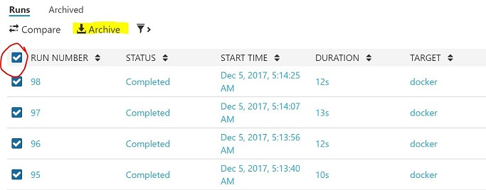

From the **Command Prompt** rerun `python run.py` and go to the **Jobs** pannel to monitor jobs as they are running. Once all the jobs are finish running, click on the green **Completed** button to view their output. Find the job with regularization rate 0.009765625 and report its maximum F-score (under `Max F_1 is ...`). The output on this page is produced as a result of `print` statements in the script (or functions that return output). 

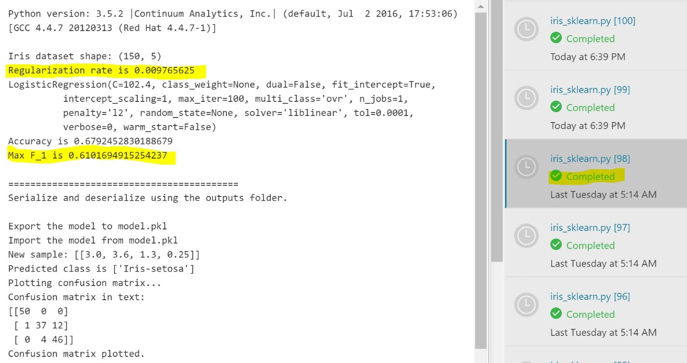

For the same run, now click on the blue link just above the green **Completed** button to see the **Run Properties** pane. Find the regularization rate and the F-score in this tab. The output in this pane is created partly as a result of meta-data collected for each job (such as **Start Time** and **Duration**) and partly as a result of metrics that we logged using the `run_logger.log` function. 

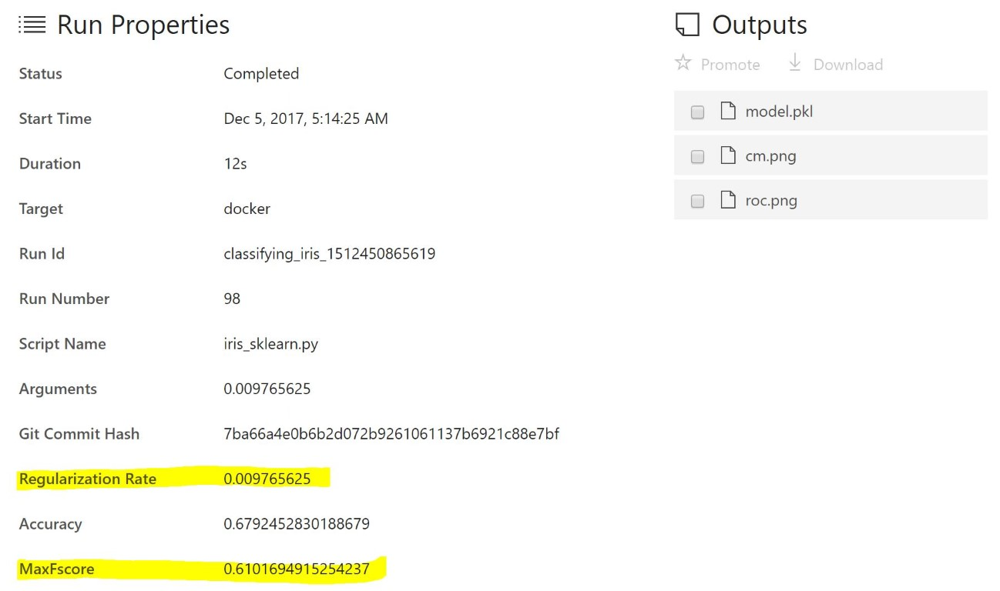

Scroll down to see the visuals created by array we logged, including the `Fscore` visual that should now also appear.


Scroll further down to look at visualizations created by the Python script itself. These visualizations were not explicitly logged, but they are also tracked and presented here.


Click on **All Runs** from the **Runs** tab and click on the little settings icon on the right.

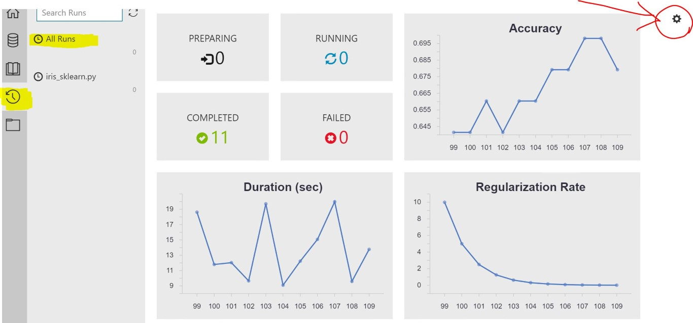
   
In the window that opens, put a check mark in the box next to `MaxFscore` then click on **Apply**.

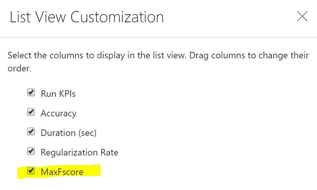

We should now see an additional plot showing the value for `MaxFscore` accross the different runs.

Choose the two models with the highest `MaxFscore` (simply click on the two highest point on the chart). Notice how doing so automatically selects them in the table with all the runs just below the chart. Now click on the **Compare** button to compare the two models.


   
Of the two models, find the one with the highest accuracy (we will find accuracy under **Logged Metrics**) and note its `runNumber` (at the very top). Then click on **Run List** to return to the table of all the runs and this time click on the `RUN NUMBER` for that model.

## Review the run history in detail

In Azure Machine Learning Workbench, every script execution is captured as a run history record. If you open the **Runs** view, you can view the run history of a particular script.

1. To open the list of **Runs**, select the **Runs** button (clock icon) on the left toolbar. Then select **iris_sklearn.py** to show the **Run Dashboard** of `iris_sklearn.py`.

   

1. The **Run Dashboard** tab opens. 

   Review the statistics captured across the multiple runs. Graphs render in the top of the tab. Each run has a consecutive number, and the run details are listed in the table at the bottom of the screen.

   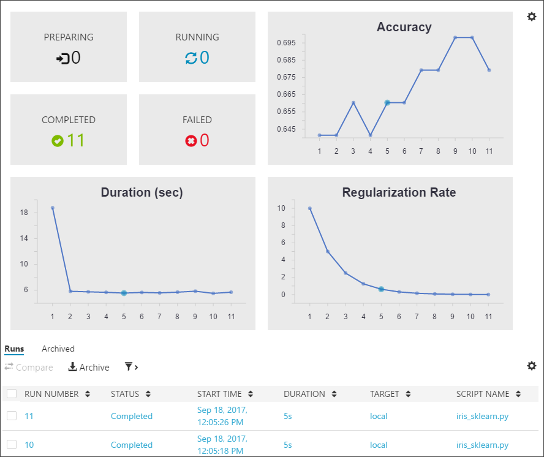

1. Filter the table, and then select any of the graphs to view the status, duration, accuracy, and regularization rate of each run. 

1. Select the checkboxes next to two or more runs in the **Runs** table. Select the **Compare** button to open a detailed comparison pane. Review the side-by-side comparison. 

1. To return to the **Run Dashboard**, select the **Run List** back button on the upper left of the **Comparison** pane.

   

1. Select an individual run to see the run detail view. Notice that the statistics for the selected run are listed in the **Run Properties** section. The files written into the output folder are listed in the **Outputs** section, and you can download the files from there.

   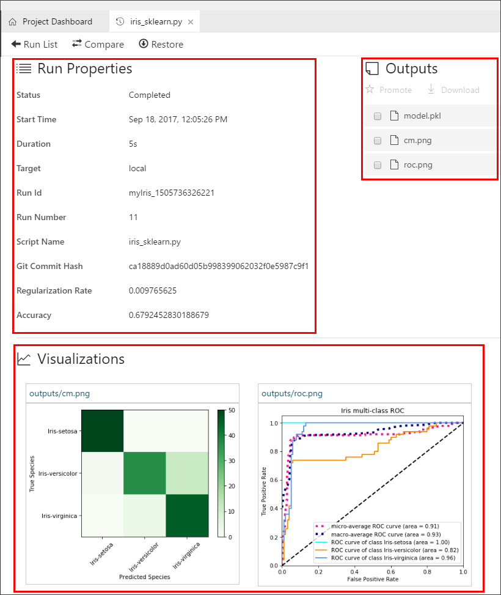

   The two plots, the confusion matrix and the multi-class ROC curve, are rendered in the **Visualizations** section. All the log files can also be found in the **Logs** section.

In this second part of the three-part tutorial series, you learned how to:
* Open scripts and review the code in Workbench
* Execute scripts in a local environment
* Review the run history
* Execute scripts in a local Docker environment

## Next steps

1. [Deploy Model](./07.DeployModel.md){:target="_blank"}