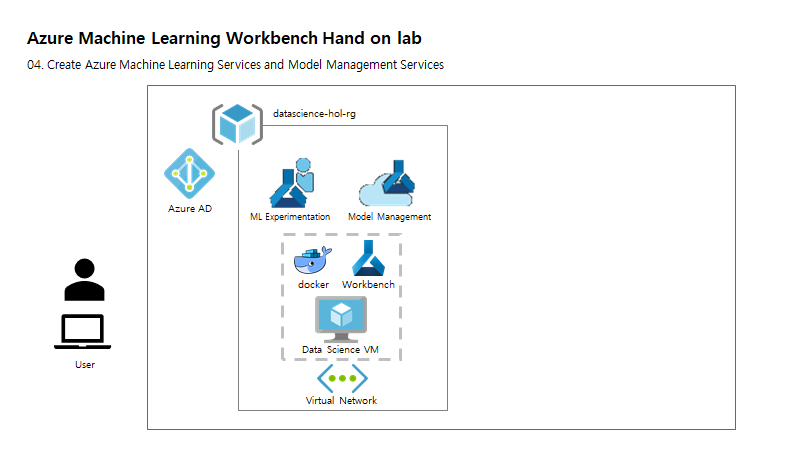

# Tutorial 2: Classify Iris - Build a model (2/3)



Azure Machine Learning services (preview) are an integrated, data science and advanced analytics solution for professional data scientists to prepare data, develop experiments, and deploy models at cloud scale.

This tutorial is **part two of a three-part series**. In this part of the tutorial, you use Azure Machine Learning services to:

* Open scripts and review code
* Execute scripts in a local environment
* Review run histories
* Execute scripts in a local Docker environment

## 2. Run iris_sklearn.py in your local environment

1. Launch the Azure Machine Learning Workbench application.

2. Open the **myIris** project you created in previous step.

3. In the open project, select the **Files** button (the folder icon) on the far-left pane to open the file list in your project folder. And select the **iris_sklearn.py** Python script file. 


The code opens in a new text editor tab inside the Workbench. This is the script you use throughout this part of the tutorial. 

> The code you see might not be exactly the same as the preceding code, because this sample project is updated frequently.

4. In the toolbar of that tab, select **local** as the execution environment, and `iris_sklearn.py` as the script to run. These may already be selected.


5. Move to the right side of the toolbar and enter `0.01` in the **Arguments** field. This value corresponds to the regularization rate of the logistic regression model.


6. Select the **Run** button. A job is immediately scheduled. The job is listed in the **Jobs** pane on the right side of the workbench window. 


After a few moments, the status of the job transitions from **Submitting**, to **Running**, and finally to **Completed**.

7. Click **Completed** in the job status text in the **Jobs** pane. 


A pop-up window opens and displays the standard output (stdout) text for the run. To close the stdout text, select the **Close** (**x**) button on the upper right of the pop-up window.


8. In the same job status in the **Jobs** pane, select the blue text **iris_sklearn.py [n]** (_n_ is the run number) just above the **Completed** status and the start time. The **Run Properties** window opens and shows the following information for that particular run:
  - **Run Properties** information
  - **Outputs**
  - **Metrics**
  - **Visualizations**, if any
  - **Logs** 

When the run is finished, the pop-up window shows the following results:


> Because the tutorial introduced some randomization into the training set earlier, your exact results might vary from the results shown here.

9. Close the **Run Properties** tab, and then return to the **iris_sklearn.py** tab. 

## 3. Running multiple experiments

There are many way you can conduct experiment in different envrironments. Here you'll do experiments in three different ways.

  - 3.1. Run scripts in local Docker environments
  - 3.2. Run multiple experiments on Docker using Cli in a local machine
  - 3.3. Run scripts in remote Docker environments

### 3.1. Run scripts in local Docker environments

  Since you're about to experiment Docker as a first time in lab, it will **take around 11 minutes for the first time to finish an experiment**. With following step ML workbench help you to download new Docker images for your Docker environment.

  1. On the left pane, select the **Folder** icon to open the **Files** list for your project. Expand the `aml_config` folder. 

  2. There are several environments that are preconfigured: **docker-python**, **docker-spark**, and **local**.  

  3. Run the **iris_sklearn.py** script by using the **docker-python** environment: 

  - On the left toolbar, select the **Clock** icon to open the **Runs** pane. Select **All Runs**. 

  - On the top of the **All Runs** tab, select **docker-python** as the targeted environment instead of the default **local**. 

  - Next, move to the right side and select **iris_sklearn.py** as the script to run. 

  - Leave the **Arguments** field blank because the script specifies a default value. 

  - Select the **Run** button.

  4. Observe that a new job starts. It appears in the **Jobs** pane on the right side of the workbench window.

  When you run against Docker for the first time, the job takes a few extra minutes to finish. 

  Behind the scenes, Azure Machine Learning Workbench builds a new Docker file. 
  The new file references the base Docker image specified in the `docker.compute` file and the dependency Python packages specified in the `conda_dependencies.yml` file. 

  The Docker engine performs the following tasks:

  - Downloads the base image from Azure.
  - Installs the Python packages specified in the `conda_dependencies.yml` file.
  - Starts a Docker container.
  - Copies or references, depending on the run configuration, the local copy of the project folder.      
  - Executes the `iris_sklearn.py` script.

  In the end, you should see the exact same results as you do when you target **local**.

### 3.2. Run multiple experiments on Docker using Cli in a local machine

  We will now run multiple experiments in order to perform model selection. Each experiment will consist of a model with a different regularization parameter. To make it easier to iterate over the different vaules of the regularization parameter, we have the short script called run.py with creates a list of regularization parameters we want to iterate over and then runs the same az ml experiment submit command we ran earlier, but this time with the regularization parameter explicitly passed as well. 

  1. Go to **File > Open Project (Code)** to edit the project scripts using Code. 

  2. __Open__ **run.py** in Code and __change__ **local** to **docker-python** in line 9. And save the change.

  3. Return to the __command line__ and run **python run.py** to run multiple experiments automatically. 

  4. As the experiments are running, __return to the Workbench__ and open the **Jobs** pannel on the right-hand side and monitor jobs as they’re running. Click on the green Completed button for one of the jobs to examine the logs created by the script.

### 3.3. Run scripts in remote Docker environments

  In this section we create an experiment, examine its configuration, and run the experiment on a remote Docker container. We set up the experiment and then run all experiments from the command line interface (Azure CLI).

  To save time, use Instructor's parameters to run cli.

  |key|value|
  |---|---|
  |dsvm_docker|dsvm_docker|
  |<IP_ADDRESS>|azmlholdsvm.westus.cloudapp.azure.com|
  |<SSH_USER>|azureadmin|
  |<SSH_PASSWORD>|<SSH_PASSWORD>|

  1. With above parameters, run following cli command to create a new environment.

  ```
  az ml computetarget attach remotedocker --name dsvm_docker --address azmlholdsvm.westus.cloudapp.azure.com --username azureadmin --password <SSH_PASSWORD>
  ```

  2. Before running against the remote VM, we need to prepare it with the project's environment by running next cli command.

  ```
  az ml experiment prepare -c dsvm_docker
  ```

  3. Once we configure the compute target, we can use the following command to run the script on a remote machine.

  ```
  az ml experiment submit -c dsvm_docker iris_sklearn.py
  ```

  4. While experiments are running on a remote machine, __return to the Workbench__ and open the **Jobs** pannel on the right-hand side and monitor jobs as they’re running. C

## Next steps

[Continue to Model Selection](./06.ModelSelection(con).md)
