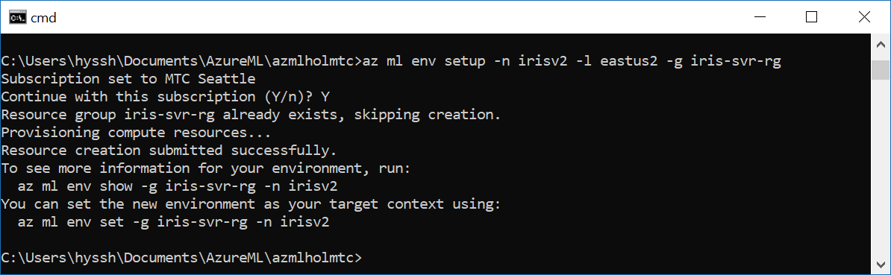

# Tutorial 3: Classify Iris: Deploy a model (3/3)


Azure Machine Learning (preview) is an integrated, end-to-end data science and advanced analytics solution for professional data scientists. Data scientists can use it to prepare data, develop experiments, and deploy models at cloud scale.

This tutorial is **part three of a three-part series**. In this part of the tutorial, you use Machine Learning (preview) to:

* Locate the model file.
* Generate a scoring script and schema file.
* Prepare the environment.
* Create a real-time web service.
* Run the real-time web service. 

## 6. Download the model pickle file

Get the pickle file to depoly score model.

1. To locate the file, select the **Runs** button (clock icon) on the left pane to open the list of **All Runs**. 

2. The **All Runs** tab opens. In the table of runs, select one of the recent runs where the target was **local** and the script name was **iris_sklearn.py**. 

3. The **Run Properties** pane opens. In the upper-right section of the pane, notice the **Outputs** section.

4. To download the pickle file, select the check box next to the **model.pkl** file, and then select **Download**. Save the file to the root of your project folder. The file is needed in the upcoming steps.


## 7. Get the scoring script and schema files

To deploy the web service along with the model file, you also need a scoring script. Optionally, you need a schema for the web service input data. The scoring script loads the **model.pkl** file from the current folder and uses it to produce new predictions.

1. Open the command-line interface (CLI).
   In the Machine Learning Workbench application, on the **File** menu, select **Open Command Prompt**.

2. Run following command to create a folder to store schema file.

```
mkdir outputs
```

3. Run following command to generate JSON schema file.
    This script creates a JSON file in the **Outputs** section, which captures the input data schema required by the model.

```python
python score_iris.py
```

6. Note the **Jobs** pane on the right side of the **Project Dashboard** pane. Wait for the latest **score_iris.py** job to display the green **Completed** status. Then select the hyperlink **score_iris.py** for the latest job run to see the run details. 

7. On the **Run Properties** pane, in the **Outputs** section, select the newly created **service_schema.json** file. Select the check box next to the file name, and then select **Download**. Save the file into your project root folder.

    

Now you're ready to prepare your environment to operationalize the model.

## 8. Prepare to operationalize locally [For development and testing your service]
Use _local mode_ deployment to run in Docker containers on your local computer.

You can use _local mode_ for development and testing. The Docker engine must be running locally to complete the following steps to operationalize the model. You can use the `-h` flag at the end of each command to show the corresponding help message.

>Web services deployed locally do not show up in Azure Portal's list of services. They will be running in Docker on the local machine.

1. Create the environment. You must run this step once per environment. For example, run it once for development environment, and once for production. Use _local mode_ for this first environment. You can try the `-c` or `--cluster` switch in the following command to set up an environment in _cluster mode_ later.

   > If you need to update az ml cli, please you following command in the commeand windows
   ```python
   pip install azure-cli-ml
   ```

   The following setup command requires you to have Contributor access to the subscription. If you don't have that, you need at least Contributor access to the resource group that you are deploying to. In the latter case, you need to specify the resource group name as part of the setup command by using the `-g` flag. (This command will take around 3 minutes.)

   ```azurecli
   az ml env setup -n <new deployment environment name> --location <e.g. eastus2>
   ```
   
    Sample Result:

    

   Follow the on-screen instructions to provision a storage account for storing Docker images, an Azure container registry that lists the Docker images, and an Azure Application Insights account that gathers telemetry. If you use the `-c` switch, the command will additionally create a Container Service cluster.
   
   The cluster name is a way for you to identify the environment. The location should be the same as the location of the Model Management account you created from the Azure portal.

   To make sure that the environment is set up successfully, use the following command to check the status:

   ```azurecli
   az ml env show -n <deployment environment name> -g <existing resource group name>
   ```

   Make sure that "Provisioning State" has the value "Succeeded", as shown, before you set the environment in step 5:

   
 
3. If you didn't create a Model Management account in previous parts of this tutorial, do so now. This is a one-time setup.
   ```azurecli
   az ml account modelmanagement create --location <e.g. eastus2> -n <new model management account name> -g <existing resource group name> --sku-name S1
   ```
   
4. Set the Model Management account.
   ```azurecli
   az ml account modelmanagement set -n <youracctname> -g <yourresourcegroupname>
   ```

5. Set the environment.

   After the setup finishes, use the following command to set the environment variables required to operationalize the environment. Use the same environment name that you used previously in step 3. Use the same resource group name that was output in the command window when the setup process finished.

   ```azurecli
   az ml env set -n <deployment environment name> -g <existing resource group name>
   ```

6. To verify that you have properly configured your operationalized environment for local web service deployment, enter the following command:

   ```azurecli
   az ml env show
   ```

Now you're ready to create the real-time web service.

> You can reuse your Model Management account and environment for subsequent web service deployments. You don't need to create them for each web service. An account or an environment can have multiple web services associated with it.

## 9. Create a real-time web service in your local pc using a line of command

> Before you run following command, check docker is running on your local environment.

1. To create a real-time web service, use the following command:

   ```azurecli
   az ml service create realtime -f score_iris.py --model-file model.pkl -s service_schema.json -n irisapp -r python --collect-model-data true -c aml_config\conda_dependencies.yml
   ```

   >The service name, which is also the new Docker image name, must be all lowercase. Otherwise, you get an error. 

2. When you run the command, the model and the scoring files are uploaded to the storage account you created as part of the environment setup. The deployment process builds a Docker image with your model, schema, and scoring file in it, and then pushes it to the Azure container registry: **\<ACR_name\>.azureacr.io/\<imagename\>:\<version\>**. 

   The command pulls down the image locally to your computer and then starts a Docker container based on that image. If your environment is configured in cluster mode, the Docker container is deployed into the Azure Cloud Services Kubernetes cluster instead.

   As part of the deployment, an HTTP REST endpoint for the web service is created on your local machine. After a few minutes, the command should finish with a success message. Your web service is ready for action!

3. To see the running Docker container, use the **docker ps** command:

   ```azurecli
   docker ps
   ```

## 10. Run the real-time web service

To test the **irisapp** web service that's running, use a JSON-encoded record containing an array of four random numbers.

1. The web service includes sample data. When running in local mode, you can call the **az ml service usage realtime** command. That call retrieves a sample run command that you can use to test the service. The call also retrieves the scoring URL that you can use to incorporate the service into your own custom app.

   ```azurecli
   az ml service usage realtime -i <web service ID>
   ```

2. To test the service, execute the returned service run command:
    
   ```azurecli
   az ml service run realtime -i <web service ID> -d "{\"input_df\": [{\"petal width\": 0.25, \"sepal length\": 3.0, \"sepal width\": 3.6, \"petal length\": 1.3}]}"
   ```

   The output is **"Iris-setosa"**, which is the predicted class. (Your result might be different.) 

## Summarize this hands on lab

In this third part of the three-part tutorial series, you have learned how to use Machine Learning to:
* Locate the model file.
* Generate a scoring script and schema file.
* Prepare the environment.
* Create a real-time web service.
* Run the real-time web service.
* Examine the output blob data. 

You have successfully run a training script in various compute environments. You have also created, serialized, and operationalized a model through a Docker-based web service. 

## Next Step

[Run TensorFlow](./08.MNIST_TensorFlow.md)